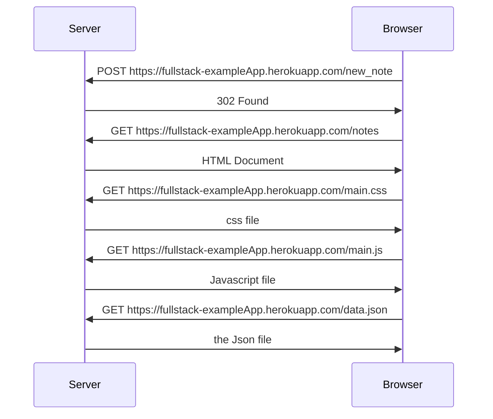

```mermaid

sequenceDiagram
    participant Server
    participant Browser

    Browser->>Server: POST https://fullstack-exampleApp.herokuapp.com/new_note
    Server->>Browser: 302 Found

    Browser->>Server: GET https://fullstack-exampleApp.herokuapp.com/notes
    Server->>Browser: HTML Document 
    Browser->>Server: GET https://fullstack-exampleApp.herokuapp.com/main.css
    Server->>Browser: css file 
    Browser->>Server: GET https://fullstack-exampleApp.herokuapp.com/main.js
    Server->>Browser: Javascript file
    Browser->>Server: GET https://fullstack-exampleApp.herokuapp.com/data.json
    Server->>Browser: the Json file 

```